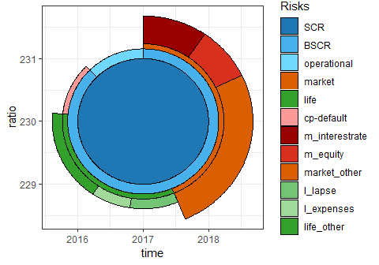

<!-- README.md is generated from README.Rmd. Please edit that file -->

# ggsolvencyii 0.1.1


<P>

<P>

<P>

### status

[](https://travis-ci.com/vanzanden/ggsolvencyii)
[](https://ci.appveyor.com/project/vanzanden/ggsolvencyii/branch/master)
[](https://www.r-pkg.org/pkg/ggsolvencyii)
<!--[](https://www.r-pkg.org/pkg/ggsolvencyii)-->
[](https://www.r-pkg.org/pkg/ggsolvencyii)
[](https://codecov.io/github/vanzanden/ggsolvencyii?branch=master)

## Overview

The goal of ggsolvencyii is to provide ‘ggplot2’-geom’s to show the
composition of the Solvency (II) Capital Requirement (SCR) from
(diversified) risks and subrisks, whether for standard formula (SF) or
(partial) intern models (IM/PIM).

<!-- 
[](https://ci.appveyor.com/project/vanzanden/ggsolvencyii/branch/master)
[](https://CRAN.R-project.org/package=ggsolvencii)

[](https://codecov.io/gh/vanzanden/ggsolvencyii)
-->

## Installation

You can install ggsolvencyii from Cran (stable release)

``` r
install.packages("ggsolvencyii")
```

or (develoment version) from Github:

``` r
# install.packages("devtools")
devtools::install_github("vanzanden/ggsolvencyii")
```

<!--# or from the binary in github.com/vanzanden/ggsolvencyii/binaries/windows-->

## short version

This README is a short version of the vignette ‘ggsolvencyii’ at
<https://cran.r-project.org/web/packages/ggsolvencyii/index.html> which
shows the same examples with more code. The complete annotated code for
the first figure is shown in vignette ‘showcase’. A further elaboration
on the inner workings of the package and the use of parameter-values and
tables can be found in vignette "coding overview’.

## example

ggsolvencyii builds on ggplot-functionality and provides three geom’s:
`geom_sii_risksurface`, `geom_sii_riskoutline` and
`geom_sii_riskconnection`.

These three geom’s were used to produce the following showcase plot
which might be used for an ORSA (Own Risk and Solvency Assessment)
report.

    #> scaling is based on inputvalue (maxscrvalue) of 25.7433642812936
    #> scaling is based on a max (level= 1) value of 25.7433642812936
    #> scaling is based on a max (level= 1) value of 25.7433642812936
    #> scaling is based on a max (level= 1) value of 25.7433642812936

<!-- -->

The total surface (to the centerpoint of each circle) of the outer
segments show the size of undiversified risks. Diversification is made
visible by the difference between the risk segment and the next segment
nearer to the center of the plot. The red (out)lines are displayed for
comparison with the previous SCR buildup.

## Baseplot and options

### base

An life insurer reports its solvency ratio following Standard Formula
rules, with English names for all risks. It has a set of risks,
diversification effects, and accumulations to the SCR for the current
situation (‘id’=1) and two two-year ORSA scenarios.
<!--The results are stored in a datafile of which the first lines and columns are shown here: 

      id   time   comparewithid   ratio        SCR   Adjustment-LACDT       BSCR    BSCR_div
---  ---  -----  --------------  ------  ---------  -----------------  ---------  ----------
1      1   2016              NA     230   23.00000         -10.000000   28.00000   -9.000000
4      2   2017               1     233   23.14993          -9.158458   27.30838   -9.135998
7      3   2018               2     238   19.99461          -9.435391   24.43000   -8.402552
--> The SCR composition of the current situation (id = 1) is shown below
where `sii_z_ex1_data` a tidyverse transformation is of the data.

``` r
ggplot() +
  geom_sii_risksurface(
    data = sii_z_ex1_data[sii_z_ex1_data$id == 1, ],
    mapping = aes(x = time, y = ratio, id = id, value = value, 
                           description = description, 
                           fill = description, color = description) ) +
theme_bw() +
scale_fill_manual(name = "Risks",values = sii_x_fillcolors_sf16_eng) +
scale_color_manual(name = "Risks",values = sii_x_edgecolors_sf16_eng)
#> scaling is based on a max (level= 1) value of 23
```


### structure

`Geom_sii_risksurface` uses one default table for this plot
`sii_structure_sf16_eng`. It defines each risks by indicating from which
combined ‘child’-risks and diversification (suffix ‘d’) it is made up.
Passing another structure table makes this geom usable for localisation
or for internal models.

### levelmax

To prevent cluttering of the legend it is possible to group the smallest
items of a level by providing a levelmax-table in such a way that the
indicated maximum items in that level is not exceded. the example is on
another dataset `sii_z_ex2_data`, with only one SCR result.

<!-- -->

### Rotation and squared

`rotationdescription` Rotates the plot in such a way that the indicated
item (can be on either level, i.e. works also on ‘life’ or
‘operational’) is plotted on just on the righthandside of ‘12
o’clock’. \`rotationdegrees’ provides an added rotation. The example
rotates ‘m\_equity’ to 12 ’o clock, and then 45 degrees counter
clockwise.

The option ‘squared’ makes a square plot, with the surface of all
segments still in proportion.
 <!--

The second plot shows a comparison between a circle and square plot of the same data. Note that the radius of the SCR circle is smaller than the size of the SCR square and that angles are different because in the corners there is 'additional' surface available compared to a circle.


```
#> scaling is based on a max (level= 1) value of 30
#> scaling is based on a max (level= 1) value of 30
```


 ### scaling
all SCR-buildups from a single call to `geom_sii_risksurface` or `geom_sii_riskoutline` plot are by default scaled in such a way that the largest SCR has a plotradius of one. When combining more calls, with several datasets a manual `maxscrvalue`-value can be given as a parameter. To prevent distortion, depending on the scale of x and y axis, `scalingx` and `scalingy` parameters are available.

### Plotdetails
The plotdetails table can be passed as a parameter to `geom_sii_risksurface` and `geom_sii_riskoutline`. It indicates whether to actual plot surfaces or outlinesegments (1 to 4) *after* the composition of the round (or squared) layout of segments. An example is the seperate plotting of inner and outer segments, with different transparancy in the showcase, or only plotting the outline of the SCR itself and the lowest risklevels. See the separate vignette for a detailed explanation.

### Outlines, comparewithid
With the optional aes `comparewithid` in `geom_sii_riskoutline` it is possible (without the need of bothersome data-manipulation) to overlay  the outline of one SCR over the surfaceplot of another. This for easy comparison between the two. See vignettes "geom_sii_riskoutline" and "geom_sii_riskconnection" for details.
-->

## additional parameters

additional parameters, some in the form of tables, can be used for
determing what parts of the calculated circle-segments to plot
(‘plotdetails’), scaling (‘maxscrvalue’, ‘scalingx’, ‘scalingy’), or
for easy comparison between two instances of a SCR buildup (aesthetic
‘comparewithid’).
